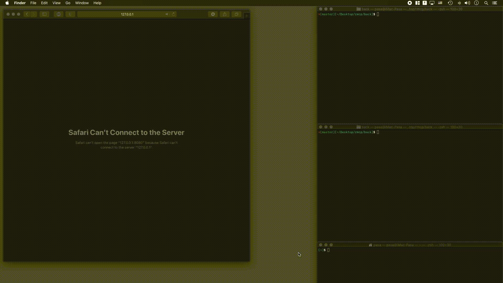

# Minecraft Check Servers Ruby Version

Данное приложение было разработано из целей получения знаний!

### Лучше используйте Java версию.	

## Программа позволяет отсканировать любой набор ip-адресов и получить базовую информацию о Minecraft серверах.

### Данное приложение является горизонтально-масштабируемым.

При разработке данного ПО, стояла цель получения опыта работы с WEB-технологиями.

Разработано на технологиях: 

Back-End: Ruby(Sinatra, Sidekiq), Redis.

Front_end: React, TypeScript, WebPack.

Как написано выше, программа является горизонтально-масштабируемой, что достигается распределением задач по копиям запущенных экземплярова программы, через очередь воркеров Sidekiq.

Сканирование реализовано в многопоточном виде, через Sidekiq.

Количество потоков настраивается через конфиг файл "./config/sidekiq.yml", по параметру: ":concurrency: 100"

При запросе пользователя на сканирование тех или иных ip-адресов, сервер первым делом проверяет наличие каждого ip-адреса в базе данных Redis, на предмет уже полученной о нем информации.

Данные об отсканированных ip-адресах в Redis хранятся в течении 2х часов. (Реализовано, для снижения нагрузки)

Именно по этому, первое сканирование нескольких десятков тысяч ip-адресов занимает некоторое время.

Однако повторное сканирование тех же, нескольких десятков тысяч ip-aдресов, в течении 2х часов, проходит почти мгновенно.

Результаты сканирования скачиваются файлом в формате .CSV

### Запуск

1) Запуск Redis: "redis-server"

2) Запуск Sidekiq из папки "./back/": "bundle exec sidekiq -r ./server.rb -C ./config/sidekiq.yml"

3) Запуск самого сервера из папки "./back/: "ruby server.rb"

4) Подключиться к WEB-странице по порту 8080

## Демонстрация работы

### Запуск сервера

### Первое сканирование

### Повторное сканирование

### Результаты сканирования

